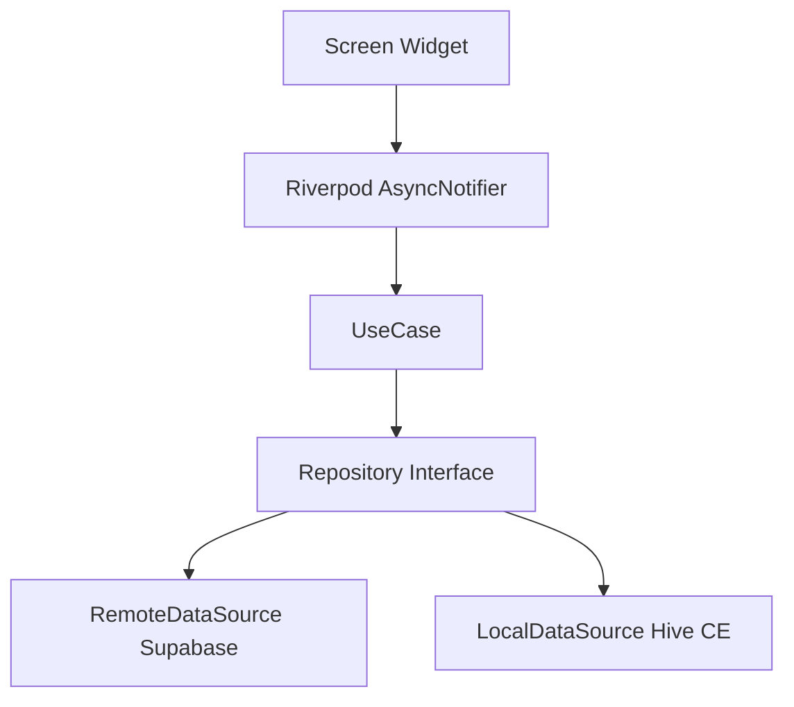

[English](README.md)

# LinkNote

URL을 붙여넣으면 메타데이터를 자동 추출하는 모바일 북마크 매니저 — 웹 링크의 저장, 정리, 검색, 공유를 하나의 앱에서.

[](https://github.com/kaywalker91/LinkNote/actions/workflows/ci.yml)


[](LICENSE)

---

## 엔지니어링 하이라이트

- **Feature-first Clean Architecture** — 6개 독립 feature 모듈, `presentation → domain → data` 레이어 경계 엄격 준수. 크로스 feature import 없음
- **타입 안전 에러 처리** — `Result<T>` 레코드 타입 + `Failure` sealed class (Freezed). 비즈니스 로직에서 예외를 던지지 않고 명시적으로 실패를 전파
- **Riverpod 3.x 코드 생성** — `@riverpod` 어노테이션 전면 적용, 수동 작성 프로바이더 0개. AsyncNotifier로 loading/data/error 3-state 관리
- **4-Job CI 파이프라인** — GitHub Actions: format + lint, test + coverage, build 검증, Semgrep OWASP 보안 스캔
- **Offline-first UX** — Hive CE 로컬 캐시 + 실시간 네트워크 감지, graceful degradation 배너
- **딥링크 지원** — 커스텀 URI 스킴 (`linknote://`) + Android/iOS 양 플랫폼 cold-start 큐 시스템
- **Material 3 디자인 시스템** — 토큰 기반 테마 (`AppColors`, `AppTextStyles`, `AppSpacing`) + 라이트/다크 모드 설정 영속화
- **Mockup-First 개발** — 목업 데이터로 UI를 먼저 완성한 뒤, Provider 내부만 교체하여 백엔드 연동. UI 코드 수정 없음

---

## 주요 기능

| 기능 | 설명 |
|------|------|
| **링크 저장** | URL 붙여넣기만으로 OG 태그 기반 제목, 설명, 썸네일 자동 파싱 |
| **컬렉션** | 폴더 생성으로 링크 분류, 컬렉션별 링크 탐색 |
| **태그 시스템** | 컬러 태그를 Chip UI로 추가/삭제, 쉼표 또는 Enter 입력 |
| **실시간 검색** | 300ms 디바운스 검색, 최근 검색어 로컬 저장 |
| **즐겨찾기** | 원탭 즐겨찾기 토글 + Optimistic UI 업데이트, 전체/즐겨찾기 필터 |
| **다크 모드** | Material 3 라이트/다크 테마, 사용자 설정 로컬 영속화 |
| **스켈레톤 로딩** | 리스트, 상세, 프로필 화면에 시머 플레이스홀더 적용 |
| **오프라인 배너** | 실시간 네트워크 상태 감지 + 연결 인식 UI |
| **딥링크** | `linknote://link/:id`, `linknote://collection/:id` 양 플랫폼 지원 |

---

## 아키텍처

각 feature는 Clean Architecture 3-layer를 갖춘 독립 모듈입니다. UI는 Riverpod provider를 구독만 하고, 모든 상태 변경은 Notifier 내부에서만 발생하여 단방향 데이터 흐름을 보장합니다.



### 프로젝트 구조

```
lib/
├── app/                        # App shell
│   ├── router/                 # GoRouter 설정, StatefulShellRoute (5탭)
│   └── theme/                  # Material 3 디자인 토큰
├── core/                       # 공통 인프라
│   ├── constants/              # 상수, 환경 변수
│   ├── error/                  # Result<T>, Failure sealed class
│   ├── logger/                 # 로깅 추상화
│   ├── network/                # Dio 클라이언트, 인증/로깅 인터셉터
│   ├── services/               # OG 태그 파서, 알림 서비스
│   ├── storage/                # Hive CE 초기화
│   └── utils/                  # Debouncer, 포매터
├── shared/                     # 재사용 컴포넌트
│   ├── extensions/             # DateTime, String, Context 확장
│   ├── models/                 # PaginatedState<T>
│   ├── providers/              # 테마, 연결 상태 프로바이더
│   └── widgets/                # 13개 공유 위젯 (스켈레톤, 빈 상태 등)
└── features/                   # Feature 모듈
    ├── auth/                   # Supabase 이메일/비밀번호 인증
    ├── link/                   # 링크 CRUD, OG 파싱, 즐겨찾기
    ├── collection/             # 컬렉션 관리
    ├── search/                 # 디바운스 검색 + 검색 기록
    ├── notification/           # 푸시 알림 피드
    └── profile/                # 프로필, 설정, 테마 전환

features/<feature>/
├── data/                       # DataSource, DTO, Mapper, Repository 구현체
├── domain/                     # Entity, Repository 인터페이스, UseCase
└── presentation/               # Provider, Screen, Widget
```

### 기술 스택

| 분류 | 기술 | 용도 |
|------|------|------|
| 프레임워크 | Flutter 3.41.4 / Dart 3.11.1 | 크로스플랫폼 모바일 |
| 상태 관리 | Riverpod 3.x + riverpod_annotation | 코드 생성 기반 리액티브 상태 |
| 라우팅 | GoRouter (StatefulShellRoute) | 선언적 5탭 내비게이션 |
| 네트워크 | Dio + Retrofit | 타입 안전 HTTP 클라이언트 + 인터셉터 |
| 로컬 저장소 | Hive CE | 경량 오프라인 퍼시스턴스 |
| 백엔드 | Supabase | 인증, PostgreSQL, 스토리지 |
| 푸시 알림 | Firebase Messaging + Crashlytics | FCM + 크래시 리포팅 + 애널리틱스 |
| 직렬화 | Freezed + json_serializable | 불변 데이터 클래스 + JSON 코드 생성 |
| 보안 | flutter_secure_storage + envied | 토큰 보관 + 빌드 타임 시크릿 난독화 |
| 린팅 | very_good_analysis + custom_lint + riverpod_lint | 엄격한 정적 분석 |

---

## 화면 구성

```
Splash ─── Login ─── Signup
              │
              ▼
         Main Shell
         ├── Home .............. 링크 목록, 즐겨찾기 필터, 페이지네이션
         ├── Search ............ 실시간 검색, 최근 검색어
         ├── Collections ....... 컬렉션 목록 → 컬렉션 상세
         ├── Notifications ..... 푸시 알림 피드 (읽음/안읽음)
         └── Profile ........... 사용자 정보, 설정, 테마 전환
              │
         전체 화면 오버레이
         ├── Link Add / Edit ... URL 입력, OG 파싱, 태그, 메모
         ├── Link Detail ....... 썸네일, 메타데이터, 외부 URL 실행
         └── Collection Form ... 컬렉션 생성 / 수정
```

| 화면 | 라우트 | 설명 |
|------|--------|------|
| Splash | `/` | 세션 확인, 인증 리디렉트 |
| Login | `/login` | 이메일/비밀번호 로그인 |
| Signup | `/signup` | 신규 계정 등록 |
| Home | `/home` | 링크 페이지네이션, 즐겨찾기 필터, 당겨서 새로고침 |
| Link Add | `/links/new` | URL 입력 시 OG 자동 파싱, 태그, 메모 |
| Link Edit | `/links/:id/edit` | 기존 링크 메타데이터 수정 |
| Link Detail | `/links/:id` | 링크 상세 보기, 외부 URL 실행 |
| Search | `/search` | 디바운스 검색, 최근 검색어 칩 |
| Collection List | `/collections` | 전체 컬렉션 + 링크 수 표시 |
| Collection Detail | `/collections/:id` | 컬렉션 내 링크 목록 |
| Collection Form | `/collections/new` | 컬렉션 생성/수정 |
| Notifications | `/notifications` | 알림 피드, 읽음 처리 |
| Profile | `/profile` | 사용자 통계, 로그아웃 |
| Settings | `/profile/settings` | 테마 모드 선택, 앱 정보 |

---

## 시작하기

### 사전 요구사항

- Flutter 3.41.4+ (stable 채널)
- Dart 3.11.1+
- Android Studio / Xcode
- Java 17+ (Android 빌드)

### 설치 및 실행

```bash
git clone https://github.com/kaywalker91/LinkNote.git
cd LinkNote

# 의존성 설치
flutter pub get

# 코드 생성 (Freezed, Riverpod, Retrofit, Hive, envied)
dart run build_runner build --delete-conflicting-outputs

# 앱 실행
flutter run
```

### 환경 변수 설정

예제 파일을 복사하고 Supabase 자격 증명을 입력합니다:

```bash
cp .env.example .env
```

```
SUPABASE_URL=https://your-project.supabase.co
SUPABASE_ANON_KEY=your-anon-key-here
```

환경 상수 재생성:

```bash
dart run build_runner build --delete-conflicting-outputs
```

> `envied` 패키지를 사용하여 빌드 타임에 시크릿을 난독화합니다. `.env` 파일은 gitignore에 포함되어 절대 커밋되지 않습니다.

---

## 테스트

3-layer 테스트 전략, `mocktail`로 경계 레이어 모킹.

| 레이어 | 테스트 수 | 범위 |
|--------|----------:|------|
| Unit | 14 | UseCase, Repository, Mapper |
| Widget | 19 | 화면 렌더링, 사용자 인터랙션 |
| Integration | 19 | 멀티 화면 플로우 (로그인 → 링크 추가, 검색 → 상세, 컬렉션 생성) |
| **합계** | **52** | |

```bash
# 전체 테스트 실행
flutter test

# 커버리지 리포트 생성
flutter test --coverage

# 특정 테스트 실행
flutter test test/features/link/domain/usecase/create_link_usecase_test.dart
```

CI 커버리지 임계값:
- **최소**: 30% (미달 시 빌드 실패)
- **목표**: 50% (미달 시 경고)
- **제외 대상**: `*.g.dart`, `*.freezed.dart`, `*.gen.dart`, `firebase_options.dart`

---

## CI/CD

`main`, `develop` 브랜치 push 및 PR 시 GitHub Actions 파이프라인 실행.

```
┌───────────┐   ┌────────────┐   ┌─────────────┐   ┌────────────────┐
│  Analyze   │   │    Test     │   │    Build     │   │ Security Scan  │
│            │   │            │   │              │   │                │
│ dart format│   │ flutter    │   │ flutter build│   │ Semgrep SAST   │
│ flutter    │──▶│ test       │   │ apk --debug  │   │ OWASP Top 10   │
│ analyze    │   │ --coverage │   │              │   │ Secrets detect │
│            │   │ Codecov    │   │              │   │                │
└───────────┘   └────────────┘   └─────────────┘   └────────────────┘
```

- **동시성 제어** — 같은 브랜치에서 이전 실행 자동 취소
- **Flutter 버전 고정** — 모든 job에서 `3.41.4` 사용
- **Codecov 연동** — generated 파일 제외 후 커버리지 업로드
- **Semgrep 스캔** — `p/default`, `p/secrets`, `p/owasp-top-ten` 룰셋
- **Fallback 시크릿 탐지** — 정규식 기반 API 키, JWT 토큰 탐색

---

## 로드맵

```
Phase 0  프로젝트 세팅               ████████████  완료
Phase 1  UI 화면 (13개 화면)         ████████████  완료
Phase 2  CRUD & 인터랙션             ████████████  완료
Phase 3  백엔드 연동                 ████████░░░░  코드 완성
Phase 4  로컬 캐시 & 성능 최적화      ████████████  완료
Phase 5  테스트 (52개)               ████████████  완료
Phase 6  CI/CD & 릴리스              ████████████  완료
```

> Phase 3 백엔드 코드는 완성 상태이며, Supabase 인프라 프로비저닝이 남아 있습니다.

---

## 프로젝트 통계

| 지표 | 값 |
|------|-----|
| Dart 소스 파일 | 156개 |
| Feature 모듈 | 6개 |
| 화면 수 | 13개 |
| 공유 위젯 | 13개 재사용 컴포넌트 |
| 테스트 | 10개 파일, 52개 테스트 케이스 |
| CI 파이프라인 job | 4개 병렬 |
| 의존성 | 21개 (prod) + 10개 (dev) |

---

## 기여하기

1. 이 저장소를 Fork합니다
2. Feature 브랜치를 생성합니다 (`git checkout -b feature/my-feature`)
3. 새 기능에 대한 테스트를 작성합니다
4. `flutter analyze`가 경고 없이 통과하는지 확인합니다
5. [PR 템플릿](.github/pull_request_template.md)을 사용하여 Pull Request를 제출합니다

아키텍처 및 리뷰 가이드라인은 [코드 리뷰 프로세스](docs/code-review-process.md)를 참고하세요.

---

## 라이선스

이 프로젝트는 MIT 라이선스로 배포됩니다 — 자세한 내용은 [LICENSE](LICENSE) 파일을 참고하세요.

---

Built by [@kaywalker91](https://github.com/kaywalker91) as a production-grade Flutter portfolio project.
