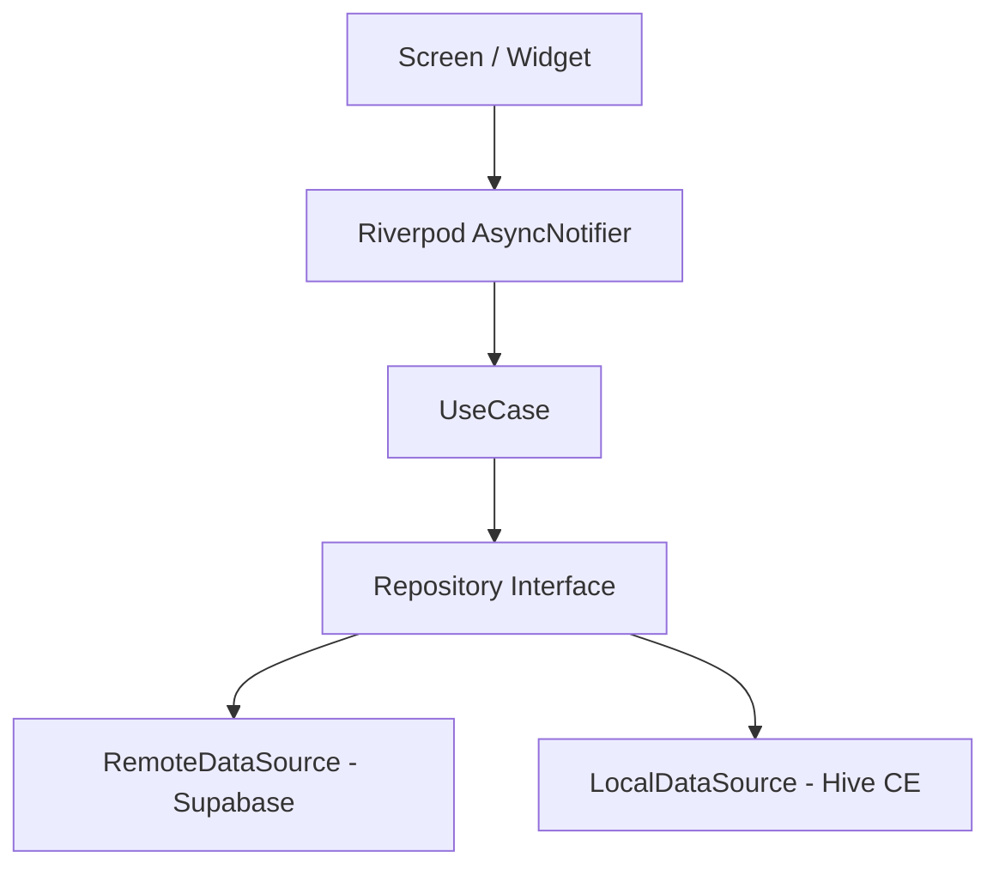

[한국어](README.ko.md)

# LinkNote

A mobile bookmark manager that auto-extracts metadata from any URL — save, organize, search, and share your web links in one place.

[](https://github.com/kaywalker91/LinkNote/actions/workflows/ci.yml)


[](LICENSE)

---

## Highlights

- **Feature-first Clean Architecture** — 6 independent feature modules with strict `presentation → domain → data` layer boundaries; zero cross-feature imports
- **Type-safe Error Handling** — `Result<T>` record type + `Failure` sealed class (Freezed). No thrown exceptions in business logic
- **Riverpod 3.x Code Generation** — `@riverpod` annotation throughout; zero hand-written providers. AsyncNotifier for 3-state (loading/data/error) management
- **4-Job CI Pipeline** — GitHub Actions: format + lint, test + coverage, build verification, Semgrep OWASP security scan
- **Offline-first UX** — Hive CE local cache with real-time connectivity detection and graceful degradation banners
- **Deep Link Support** — Custom URI scheme (`linknote://`) with cold-start queue system for both Android and iOS
- **Material 3 Design System** — Full token-based theming (`AppColors`, `AppTextStyles`, `AppSpacing`) with light/dark mode persistence
- **Mockup-First Development** — UI completed with mock data first, then backend swapped at the provider layer without touching UI code

---

## Features

| Feature | Description |
|---------|-------------|
| **Link Saving** | Paste any URL; OG tags auto-extracted for title, description, and thumbnail |
| **Collections** | Create folders to organize links; browse links by collection |
| **Tag System** | Add/remove colored tags via chip UI; comma or enter key input |
| **Smart Search** | Real-time search with 300ms debounce; recent search history persisted locally |
| **Favorites** | One-tap favorite toggle with optimistic UI update; filter between all and favorites |
| **Dark Mode** | Material 3 light/dark theme; user preference persisted to local storage |
| **Skeleton Loading** | Shimmer placeholders on lists, detail views, and profile for perceived performance |
| **Offline Banner** | Real-time network status detection with connectivity-aware UI |
| **Deep Links** | `linknote://link/:id` and `linknote://collection/:id` on both platforms |

---

## Architecture

Each feature is a self-contained module following Clean Architecture with three layers. The UI subscribes to Riverpod providers; all state mutations happen exclusively inside Notifiers, enforcing unidirectional data flow throughout the app.



### Project Structure

```
lib/
├── app/                        # App shell
│   ├── router/                 # GoRouter config, StatefulShellRoute (5 tabs)
│   └── theme/                  # Material 3 design tokens
├── core/                       # Cross-cutting concerns
│   ├── constants/              # App-wide constants, environment
│   ├── error/                  # Result<T>, Failure sealed class
│   ├── logger/                 # Logging abstraction
│   ├── network/                # Dio client, auth/logging interceptors
│   ├── services/               # OG tag parser, notifications
│   ├── storage/                # Hive CE initialization
│   └── utils/                  # Debouncer, formatters
├── shared/                     # Reusable components
│   ├── extensions/             # DateTime, String, Context extensions
│   ├── models/                 # PaginatedState<T>
│   ├── providers/              # Theme mode, connectivity providers
│   └── widgets/                # 13 shared widgets (skeleton, empty state, etc.)
└── features/                   # Feature modules
    ├── auth/                   # Supabase email/password authentication
    ├── link/                   # Link CRUD, OG parsing, favorites
    ├── collection/             # Collection management
    ├── search/                 # Debounced search with history
    ├── notification/           # Push notification feed
    └── profile/                # User profile, settings, theme toggle

features/<feature>/
├── data/                       # DataSources, DTOs, Mappers, Repository impl
├── domain/                     # Entities, Repository interface, UseCases
└── presentation/               # Providers, Screens, Widgets
```

### Tech Stack

| Category | Technology | Purpose |
|----------|-----------|---------|
| Framework | Flutter 3.41.4 / Dart 3.11.1 | Cross-platform mobile |
| State Management | Riverpod 3.x + riverpod_annotation | Code-gen reactive state |
| Routing | GoRouter (StatefulShellRoute) | Declarative 5-tab navigation |
| Network | Dio + Retrofit | Type-safe HTTP with interceptors |
| Local Storage | Hive CE | Lightweight offline-first persistence |
| Backend | Supabase | Auth, PostgreSQL database, storage |
| Push Notifications | Firebase Messaging + Crashlytics | FCM + crash reporting + analytics |
| Serialization | Freezed + json_serializable | Immutable data classes + JSON codegen |
| Security | flutter_secure_storage + envied | Token storage + build-time secret obfuscation |
| Linting | very_good_analysis + custom_lint + riverpod_lint | Strict static analysis |

---

## Screens

```
Splash ─── Login ─── Signup
              │
              ▼
         Main Shell
         ├── Home .............. Link list with favorites filter, pagination
         ├── Search ............ Real-time search, recent queries
         ├── Collections ....... Collection list → Collection detail
         ├── Notifications ..... Push notification feed with read/unread
         └── Profile ........... User info, settings, theme toggle
              │
         Full-screen overlays
         ├── Link Add / Edit ... URL input, OG parsing, tags, memo
         ├── Link Detail ....... Thumbnail, metadata, external launch
         └── Collection Form ... Create / edit collection
```

| Screen | Route | Description |
|--------|-------|-------------|
| Splash | `/` | Session check, auth redirect |
| Login | `/login` | Email/password sign-in |
| Signup | `/signup` | New account registration |
| Home | `/home` | Paginated link list, favorites filter, pull-to-refresh |
| Link Add | `/links/new` | URL input with OG auto-parse, tags, memo |
| Link Edit | `/links/:id/edit` | Edit existing link metadata |
| Link Detail | `/links/:id` | Full link view with external URL launch |
| Search | `/search` | Debounced search, recent search chips |
| Collection List | `/collections` | All collections with link counts |
| Collection Detail | `/collections/:id` | Links within a collection |
| Collection Form | `/collections/new` | Create/edit collection |
| Notifications | `/notifications` | Notification feed, mark as read |
| Profile | `/profile` | User stats, sign out |
| Settings | `/profile/settings` | Theme mode selector, app info |

---

## Getting Started

### Prerequisites

- Flutter 3.41.4+ (stable channel)
- Dart 3.11.1+
- Android Studio / Xcode
- Java 17+ (Android build)

### Installation

```bash
git clone https://github.com/kaywalker91/LinkNote.git
cd LinkNote

# Install dependencies
flutter pub get

# Run code generation (Freezed, Riverpod, Retrofit, Hive, envied)
dart run build_runner build --delete-conflicting-outputs

# Launch the app
flutter run
```

### Environment Variables

Copy the example file and fill in your Supabase credentials:

```bash
cp .env.example .env
```

```
SUPABASE_URL=https://your-project.supabase.co
SUPABASE_ANON_KEY=your-anon-key-here
```

Then regenerate environment constants:

```bash
dart run build_runner build --delete-conflicting-outputs
```

> The app uses the `envied` package for build-time secret obfuscation. The `.env` file is gitignored and never committed.

---

## Testing

Three-layer testing strategy with `mocktail` for mocking at boundary layers.

| Layer | Tests | Scope |
|-------|------:|-------|
| Unit | 14 | UseCases, Repositories, Mappers |
| Widget | 19 | Screen rendering, user interactions |
| Integration | 19 | Multi-screen flows (login → add link, search → detail, collection create) |
| **Total** | **52** | |

```bash
# Run all tests
flutter test

# Run with coverage report
flutter test --coverage

# Run a specific test suite
flutter test test/features/link/domain/usecase/create_link_usecase_test.dart
```

Coverage thresholds enforced in CI:
- **Minimum**: 30% (build fails below this)
- **Target**: 50% (warning issued below this)
- **Excluded**: `*.g.dart`, `*.freezed.dart`, `*.gen.dart`, `firebase_options.dart`

---

## CI/CD

GitHub Actions pipeline triggered on every push and PR to `main` and `develop`.

```
┌───────────┐   ┌────────────┐   ┌─────────────┐   ┌────────────────┐
│  Analyze   │   │    Test     │   │    Build     │   │ Security Scan  │
│            │   │            │   │              │   │                │
│ dart format│   │ flutter    │   │ flutter build│   │ Semgrep SAST   │
│ flutter    │──▶│ test       │   │ apk --debug  │   │ OWASP Top 10   │
│ analyze    │   │ --coverage │   │              │   │ Secrets detect │
│            │   │ Codecov    │   │              │   │                │
└───────────┘   └────────────┘   └─────────────┘   └────────────────┘
```

- **Concurrency control** — cancel-in-progress on same branch
- **Flutter version pinned** to `3.41.4` across all jobs
- **Codecov integration** with generated file exclusion
- **Semgrep** scans: `p/default`, `p/secrets`, `p/owasp-top-ten` rulesets
- **Fallback secret detection** via regex (API keys, JWT tokens)

---

## Roadmap

```
Phase 0  Project Setup              ████████████  Done
Phase 1  UI Screens (13 screens)    ████████████  Done
Phase 2  CRUD & Interactions        ████████████  Done
Phase 3  Backend Integration        ████████░░░░  Code Complete
Phase 4  Local Cache & Performance  ████████████  Done
Phase 5  Test Suite (52 tests)      ████████████  Done
Phase 6  CI/CD & Release            ████████████  Done
```

> Phase 3 backend code is complete; Supabase infrastructure provisioning is pending.

---

## Project Stats

| Metric | Value |
|--------|-------|
| Dart source files | 156 |
| Feature modules | 6 |
| Screens | 13 |
| Shared widgets | 13 reusable components |
| Test suites | 10 files, 52 test cases |
| CI pipeline jobs | 4 parallel |
| Dependencies | 21 prod + 10 dev |

---

## Contributing

1. Fork this repository
2. Create a feature branch (`git checkout -b feature/my-feature`)
3. Write tests for new functionality
4. Ensure `flutter analyze` passes with zero warnings
5. Submit a pull request using the [PR template](.github/pull_request_template.md)

See [Code Review Process](docs/code-review-process.md) for architecture and review guidelines.

---

## License

This project is licensed under the MIT License — see the [LICENSE](LICENSE) file for details.

---

Built by [@kaywalker91](https://github.com/kaywalker91) as a production-grade Flutter portfolio project.
