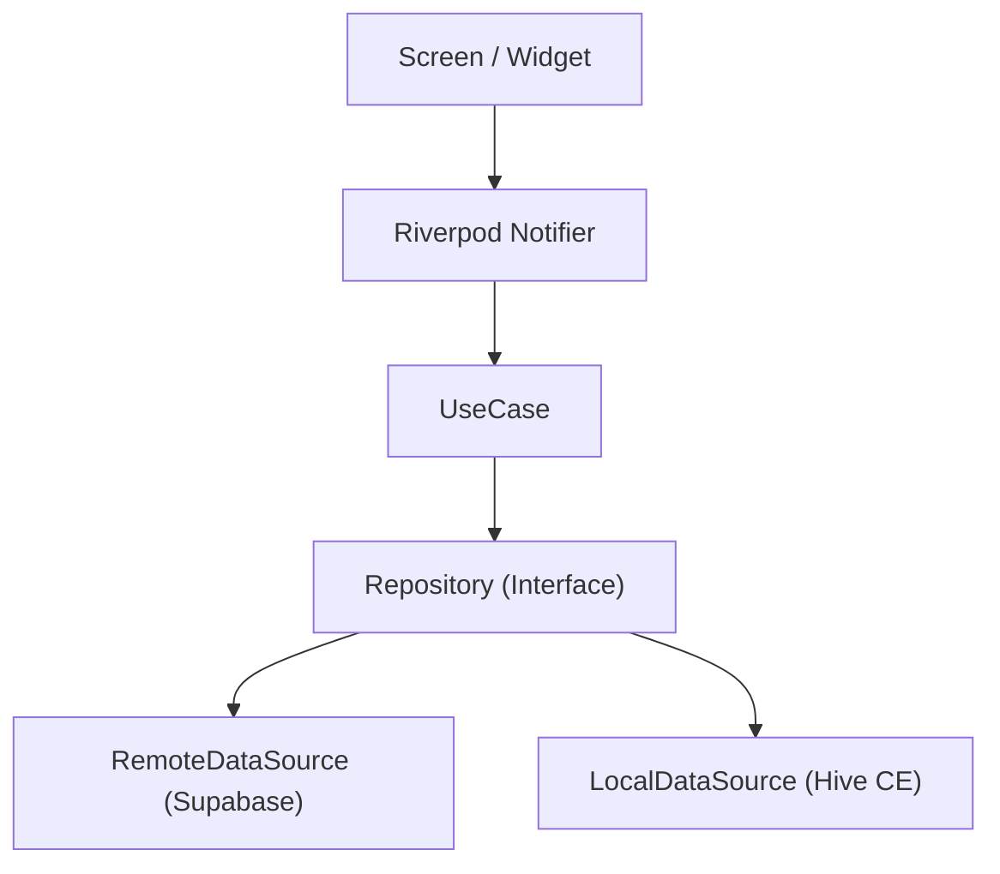

# LinkNote

<!-- TODO: 앱 시연 GIF 삽입 -->


웹 링크, 유튜브, 아티클, 메모를 저장하고 태그/컬렉션/검색으로 관리하며, 다른 사용자와 공유할 수 있는 모바일 북마크 서비스

---

## About

브라우저 북마크가 지저분하게 쌓이거나, 유튜브 링크를 "나에게 보내기"로 임시 저장하는 사람들을 위한 앱입니다.
저장 → 분류 → 검색 → 공유의 전체 흐름을 하나의 앱에서 처리합니다.

---

## Features

- **링크 저장** — URL 직접 입력, OG 태그 기반 제목/설명/썸네일 자동 파싱
- **태그 관리** — 태그 추가/삭제 (Chip UI, TextField Enter/쉼표 입력)
- **컬렉션** — 폴더 생성·수정·삭제, 링크 분류
- **즐겨찾기** — 토글 + 필터 (전체 / 즐겨찾기)
- **실시간 검색** — debounce 300ms, 최근 검색어 로컬 저장
- **딥링크** — `linknote://link/:id`, `linknote://collection/:id` (Android / iOS)
- **오프라인 배너** — 네트워크 상태 감지 및 UI 표시
- **라이트/다크 테마** — Material 3 기반, 설정에서 전환
- **스켈레톤 로딩** — 리스트/상세/프로필 로딩 UX

---

## Tech Stack

| 분류 | 기술 |
|------|------|
| Framework | Flutter / Dart |
| State Management | Riverpod + riverpod_annotation (코드 생성) |
| Routing | go_router (StatefulShellRoute 5탭 내비게이션) |
| Network | Dio + Retrofit |
| Local DB | Hive CE |
| Backend | Supabase (예정 — Phase 3) |
| Serialization | Freezed + json_serializable |
| Security | flutter_secure_storage (토큰 보관) |
| Linting | very_good_analysis + riverpod_lint + custom_lint |
| CI/CD | GitHub Actions (예정 — Phase 6) |

---

## Architecture

**Feature-first + Clean Architecture Lite**

기능별로 응집도를 높이고, 각 feature 내부는 `data / domain / presentation` 레이어로 분리합니다.
UI는 Riverpod provider를 구독만 하고, 비즈니스 상태 변경은 Notifier에서만 일어나도록 단방향 흐름을 유지합니다.

### 폴더 구조

```
lib/
├── app/               # App shell (router, theme, DI)
├── core/              # 공통 기반 (network, error, storage, logger, constants)
├── shared/            # 재사용 위젯, extensions, models
└── features/
    ├── auth/          # 인증
    ├── link/          # 링크 관리
    ├── collection/    # 컬렉션
    ├── search/        # 검색
    ├── notification/  # 알림
    └── profile/       # 프로필

features/<feature>/
├── data/              # datasource, dto, mapper, repository impl
├── domain/            # entity, repository interface, usecase
└── presentation/      # provider, screen, widget
```

### 데이터 흐름



---

## Highlights

- **Feature-first 모듈 구조** — 6개 독립 feature 모듈(`auth/link/collection/search/notification/profile`)로 확장성 확보
- **Riverpod AsyncNotifier** — `AsyncValue<T>`로 로딩/성공/실패 3-state를 명확하게 표현, UI와 상태 로직 분리
- **Result\<T\> 타입** — `core/error/result.dart` 기반 타입 안전 에러 처리 (예외 던지기 없이 명시적 실패 전파)
- **공유 위젯 시스템** — `PaginatedListView`, `SkeletonLoader`, `EmptyState`, `ErrorState`, `OfflineBanner` 재사용
- **딥링크 연동** — Android `intent-filter` / iOS `CFBundleURLSchemes` 설정, Cold Start 큐 시스템으로 초기화 완료 후 처리
- **목업 우선(Mockup-First) 개발** — UI를 목업 데이터로 먼저 완성 후 백엔드 연동 시 Provider 내부만 교체

---

## Roadmap

```
✅ Phase 0 — 프로젝트 세팅 (라우팅, 테마, 디자인 시스템)
✅ Phase 1 — 전체 화면 UI (목업 데이터, 13개 화면)
✅ Phase 2 — UI 완성 & CRUD 인터랙션 (링크/컬렉션 CRUD, 딥링크, 오프라인 배너)
🔄 Phase 3 — 백엔드 연동 (Supabase Auth + Data Layer)
⏳ Phase 4 — 로컬 캐시 & 성능 최적화 (Hive CE, Optimistic update)
⏳ Phase 5 — 테스트 작성 (Unit / Widget / Integration)
⏳ Phase 6 — CI/CD & 마무리 (GitHub Actions, Firebase App Distribution)
```

---

## Getting Started

### 사전 요구사항

- Flutter SDK (stable)
- Dart SDK ^3.10.1
- Android Studio / Xcode

### 설치 및 실행

```bash
# 의존성 설치
flutter pub get

# 코드 생성 (freezed, riverpod, retrofit, hive, envied)
dart run build_runner build --delete-conflicting-outputs

# 앱 실행
flutter run
```

### 환경 변수 설정 (Phase 3 이후 필요)

프로젝트 루트에 `.env` 파일을 생성합니다. (`.gitignore` 에 포함됨)

```
SUPABASE_URL=your_supabase_url
SUPABASE_ANON_KEY=your_supabase_anon_key
```

설정 후 코드 재생성:

```bash
dart run build_runner build --delete-conflicting-outputs
```

---

## Screens

| 화면 | 설명 |
|------|------|
| Splash | 토큰 확인 및 분기 |
| Login / Signup | 이메일 인증 |
| Home | 링크 목록, 즐겨찾기 필터, 무한 스크롤 |
| Link Add / Edit | URL 입력, OG 파싱, 태그/메모 |
| Link Detail | 저장 링크 상세 |
| Search | 실시간 검색, 최근 검색어 |
| Collection List | 컬렉션 목록 |
| Collection Detail | 컬렉션 내 링크 목록 |
| Notification | 알림 목록 |
| Profile / Settings | 사용자 정보, 테마 설정 |

---

*LinkNote — Flutter Portfolio Side Project*
